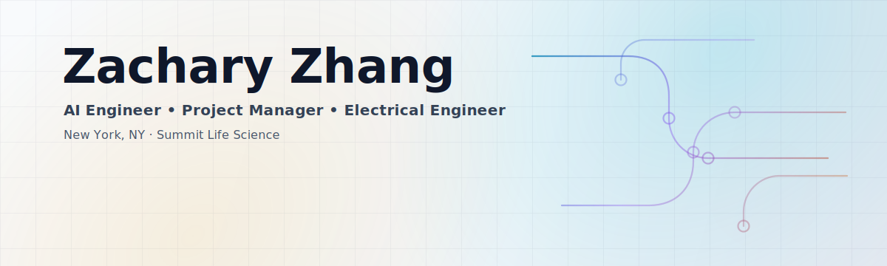

<picture>
  <source media="(prefers-color-scheme: dark)" srcset="assets/hero-dark.svg" />
  <source media="(prefers-color-scheme: light)" srcset="assets/hero-light.svg" />
  
</picture>

  
  
  

  <strong>AI Engineer &amp; Project Manager</strong> building proactive AI systems and embedded products — with a bias for shipping.

  <a href="#overview">Overview</a> · <a href="#projects">Projects</a> · <a href="#skills">Skills</a> · <a href="#contact">Contact</a>

## Overview

<table width="100%">
  <tr>
    <td valign="top">
      <h3>About</h3>
      

        Hello! I’m <strong>Zachary Zhang</strong>, an industrious entrepreneur and electrical engineer with over 5 years of experience in AI, embedded systems, and project management.
      

      

        I lead projects and build products across AI, machine learning, embedded systems, SEO, and UI/UX design.
      

    </td>
  </tr>
  <tr>
    <td valign="top">
      <h3>At a glance</h3>
      <ul>
        <li><strong>Current role:</strong> AI Engineer &amp; Project Manager — Summit Life Science</li>
        <li><strong>Location:</strong> New York, NY</li>
        <li><strong>Specializations:</strong> AI, Machine Learning, Embedded Systems, Project Management, SEO, UI/UX Design</li>
      </ul>
    </td>
  </tr>
</table>

<table width="100%">
  <tr>
    <td valign="top" width="50%">
      <strong>AI systems</strong> 
      Modeling, automation, and applied ML with real-world constraints.
    </td>
    <td valign="top" width="50%">
      <strong>Embedded &amp; edge</strong> 
      Hardware-adjacent builds and deployment-minded engineering.
    </td>
  </tr>
  <tr>
    <td valign="top" width="50%">
      <strong>Project management</strong> 
      Turning ambiguity into clear plans, milestones, and delivery.
    </td>
    <td valign="top" width="50%">
      <strong>SEO &amp; UI/UX</strong> 
      Product polish: clarity, usability, and discoverability.
    </td>
  </tr>
</table>

## Projects

<table>
  <tr>
    <td valign="top" width="50%">
      <a href="https://koin.ai"><strong>KOIN AI</strong></a> 
      Proactive AI system for real-time financial news monitoring and investment signal generation. 
      <code>Swift</code> · <code>Kotlin</code> · <code>Next.js 16</code> · <code>AI</code>
    </td>
    <td valign="top" width="50%">
      <a href="https://stablelance.com"><strong>Stablelance</strong></a> 
      Freelancing marketplace with Web3 stablecoin payments, real-time chat, notifications, and file handling. 
      <code>Next.js 16</code> · <code>Web3</code> · <code>AI</code>
    </td>
  </tr>
  <tr>
    <td valign="top" width="50%">
      <a href="https://www.medical-regulation.com"><strong>MedReg AI</strong></a> 
      AI-driven regulatory compliance for medical devices, pharmaceuticals, and dietary supplements. 
      <code>RAG</code> · <code>Next.js 16</code> · <code>AI</code>
    </td>
    <td valign="top" width="50%">
      <a href="https://anti-pua.org"><strong>Anti‑PUA</strong></a> 
      Cross-platform app to help users identify and protect themselves from manipulation tactics. 
      <code>React Native</code>
    </td>
  </tr>
  <tr>
    <td valign="top" colspan="2">
      <a href="https://zacharyzhang.com"><strong>Portfolio</strong></a> 
      Projects, technical expertise, and product design work.
    </td>
  </tr>
</table>

## Skills

  
<strong>Technical skills</strong>

   
  <ul>
    <li><strong>Languages:</strong> Python, MATLAB, HTML/CSS, Verilog, C</li>
    <li><strong>Technologies:</strong> Embedded Systems (NVIDIA Jetson), Machine Learning, Digital Signal Processing, Computer Vision</li>
    <li><strong>Tools:</strong> Figma, WebStorm, Six Sigma, Agile Methodologies</li>
  </ul>

## Contact

  
  

