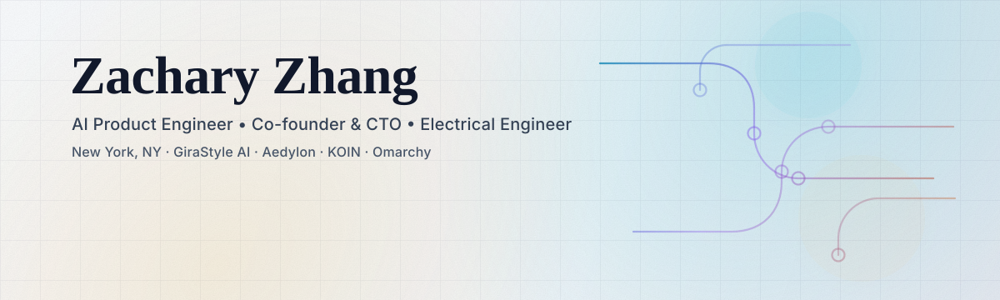

<picture>
  <source media="(prefers-color-scheme: dark)" srcset="assets/hero-dark.svg" />
  <source media="(prefers-color-scheme: light)" srcset="assets/hero-light.svg" />
  
</picture>

  
  
  

  <strong>AI Product Engineer</strong> · Co-founder &amp; CTO · AI agents, native iOS, Rust backends, full-stack web, computer vision, and edge AI

  <a href="#about">About</a> · <a href="#projects">Projects</a> · <a href="#experience">Experience</a> · <a href="#education">Education</a> · <a href="#skills">Skills</a> · <a href="#contact">Contact</a>

## About

Hi, I'm Zachary Zhang, an AI product engineer with an electrical engineering background and dual master's degrees from NYU (Electrical Engineering and Project Management). I've been building in AI since 2019, as a co-founder, core investor, and full-time engineer, shipping ten-plus products and independent projects across fintech, pharmaceutical compliance, consumer AI, and industrial edge computing. I work at the intersection of product and engineering, taking end-to-end ownership of the full product lifecycle.

## Projects

Independent projects first, then the products I built as a co-founder or CTO. Links go to the product site or the public repo.

### AI agents, ontology, and infrastructure

#### [Kigi CLI](https://kigicli.dev) · [GitHub](https://github.com/ZacharyZhang-NY/Kigi-CLI)

AI coding agent written in Rust for complex software engineering tasks. It runs as a terminal TUI, in headless CI mode, or inside editors through ACP, and it can read a repository, modify code, run tests, and keep working on an engineering task until it is complete.

- **Graph Engineering.** A Planner agent breaks a high-level goal into a DAG of dependent tasks and checks it for cycles, missing nodes, and duplicates before execution. Independent tasks run in parallel, with each Worker agent in its own Git worktree to limit conflicts and context pollution.
- **Verification.** A separate Verifier agent checks every finished node against its goal and sends failures back for rework. A Final Verifier re-checks the overall objective once all nodes complete.
- **Dynamic replanning.** Tasks discovered mid-run are added to the graph, and a Topology Optimizer removes dead dependencies, splits large nodes, and merges fragmented ones. Graph state is persisted in the project directory, so long runs can resume across sessions.
- **Agent Swarm mode** for large-scale code changes, reviews, migrations, refactors, test writing, and documentation, with the number of workers adjusted to provider capacity and rate limits.
- **One multi-model runtime** for Kimi Code, Claude, OpenAI Codex, GitHub Copilot, and Grok, plus API providers including OpenAI, Anthropic, Gemini, DeepSeek, Qwen, MiniMax, Z.AI, and Moonshot. Works with subscriptions or API keys, with model switching, thinking-effort control, and per-provider credential isolation.
- macOS, Linux, and Windows. Single-file install, auto-update, isolated config, zero telemetry.

`Rust` · `Multi-agent` · `TUI` · `ACP` · `Headless CI`

#### [Agent Company](https://agent-company.dev)

Desktop platform for running multiple AI agents as a long-lived organization. You create a company, departments, roles, and agents; a top-level goal is broken down into Department → Role → Agent → Task, and each agent receives context and tool permissions based on its position. Agents assign, execute, report, review, and replan continuously, and a pixel-art office shows each agent's status, tasks, and collaboration so the runtime stays readable.

Built with Electron (Main / Preload / Renderer), SQLite for companies, departments, roles, agents, tasks, decisions, memory, providers, browser sessions, social accounts, and audit events, and Zod validation on every IPC message. Credentials and sessions are encrypted locally, and every important state change is written to an audit log. A Policy Engine and Approval Flow decide whether a high-privilege action runs automatically, waits for human approval, or is blocked, which matters once agents connect to real AI providers, browsers, enterprise services, and social media accounts.

`Electron` · `TypeScript` · `SQLite` · `Zod` · `Multi-agent`

#### [Elydora Infra](https://elydora.com)

Accountability and audit infrastructure for autonomous AI agents. Every key action gets a verifiable, tamper-evident, traceable record, so an organization can answer what an agent did, when, and why. Actions are signed with Ed25519 to prove the actor, and consecutive records are linked in a hash chain: changing any historical record breaks verification of everything after it.

The Elydora Responsibility Protocol (ERP) defines this as an open protocol independent of any model, agent framework, or application, with four core structures: EOR (operation records), ECH (chain hashes), EAR (acknowledgement receipts), and EER (epoch roots). Target uses include coding agents, enterprise agents, financial agents, multi-agent systems, and autonomous organizations that hold real assets and execution rights.

`Ed25519` · `Hash chain` · `Protocol design` · `Agent infrastructure`

#### [Tessovis](https://tessovis.com)

Self-hosted ontology runtime for enterprises. It maps data spread across ERP, MES, WMS, databases, files, and event streams into business objects with explicit semantics, relationships, permissions, and behavior, so people and AI agents work on the same enterprise model. An Ontology Kernel turns tables, fields, and APIs into Object, Property, Link, Function, and Action; connectors and a mapping layer absorb source-schema changes so applications never depend on the underlying database schema.

Reads go through the Object Runtime and writes go through the Action Engine, which validates parameters, checks permissions, runs approvals, records audits, and handles transactions before writing back to ERP, MES, and other source systems. AI agents act as permission-bounded operators: they read the object graph, call functions and models, and propose actions, with high-risk actions routed to human approval. An Observed World / Simulated World design forks the current state into an isolated sandbox for graph propagation, anomaly detection, optimization, causal analysis, multi-agent, discrete-event, and system-dynamics simulation; a validated plan then becomes real actions. Also includes AI orchestration, graph analysis, process mining, a model runtime, an application builder, and a type-safe OSDK. Supports private and offline deployment.

`Ontology` · `Action Engine` · `Simulation` · `OSDK` · `On-premise`

#### CityOS

AI city operating system for city governance and government decision making, built on a DataOS + AgentOS architecture. Population, traffic, business, industry, commerce, public facilities, events, and public opinion data are mapped into city digital objects linked by an ontology, so AI agents can query, analyze, predict, and simulate against the real state of the city. A city-level multi-agent system splits responsibilities across industry and economy, traffic, public services, safety, enterprise services, and public opinion. Users ask questions in natural language, such as why a district's consumption changed or what is causing congestion, and the system pulls the relevant data sources and agents, then maps results back to specific objects and areas.

Prediction and simulation cover population and traffic shifts, holiday crowds, industrial development, investment policy, traffic changes, resource allocation, extreme weather, and public events, so different options can be compared before a policy is executed. An Action layer turns analysis into tasks for government departments, agents, IoT devices, unmanned systems, or third-party systems: Data → Ontology → Agent → Prediction → Simulation → Action.

Completed a POC for the Kuala Lumpur city government in Malaysia and placed third in a CityOS hackathon.

`Multi-agent` · `Ontology` · `Simulation` · `GovTech`

### Products built as co-founder or CTO

#### [KOIN AI](https://koin.ai)

AI investment analysis and automated asset management platform for the US market, built from zero as co-founder, CTO, and core investor. Native iOS and Android apps, a web product, and backend services sit on a financial data platform that continuously processes data, computes indicators, and runs AI analysis for about 20,000 US stocks and 20,000+ ETFs, covering single stocks, ETFs, portfolios, and market-level research.

KOIN Brain is a 7×24 real-time market monitoring system on a multi-agent architecture. It watches prices, company data, news, market events, and user portfolios, then handles information gathering, analysis, risk identification, and decision support. The AI system connects to users' brokerage accounts for real-time analysis of assets, positions, and market changes, and for automated portfolio management. I also worked on the US financial infrastructure and compliance side: brokerage and trading-system integration, and the SEC/FINRA-related qualifications that allow AI-automated management of user securities accounts, one of the earlier platforms in the US to reach that model.

`Swift` · `Kotlin` · `Next.js` · `Multi-agent` · `Financial data`

#### [GiraStyle AI](https://girastyleai.com)

AI fashion platform with a consumer-facing native iOS app and an enterprise web platform. I handled product requirements, interaction flows, and UI/UX, then built the iOS app in SwiftUI, with AI used for outfit recommendations, style understanding, and personalization. The enterprise platform, built with React, TypeScript, and TanStack, gives business customers one interface for business management, data management, and AI features. I also own the system architecture, API design, data models, user and permission system, and the core business flows connecting the mobile app, enterprise console, and AI services.

`SwiftUI` · `React` · `TypeScript` · `TanStack` · `API design`

#### [Aedylon](https://aedylon.com)

AI advertising production and delivery platform. I built the core system from zero: the aedylon.com website, client portal, internal admin, and review platform on the front end, and a Rust backend covering project management, permissions, files, tasks, review, version management, and payments.

Each ad project runs through a state machine: client onboarding, quote, deposit, production, internal review, client review, revisions, final payment, and delivery of the final HD assets. Dynamic quotes and deposit ratios, payment callbacks, automatic stage unlocking, asset versioning, and review sign-off replace a process that used to be spread across manual communication, file transfers, and payment platforms.

`Rust` · `Workflow state machine` · `Payments` · `React`

#### [Stablelance](https://stablelance.com)

Freelance services marketplace settled in stablecoins, similar in shape to Fiverr: service listings, matching, orders, project collaboration, file delivery, real-time chat, and settlement. I designed and built the platform end to end, including Web3 wallet creation and the account system, stablecoin deposits and withdrawals, the full order lifecycle, project file management, real-time messaging, permissions, data models, APIs, transaction states, error handling, and production deployment. The product launched and has since stopped operating.

`Next.js` · `Web3` · `Stablecoin payments` · `Real-time chat`

### Consumer AI and compliance

#### [Ask the Greatest](https://the-greatest.win)

Consumer AI app for ongoing natural-language conversations with historical figures, combining each figure's background and body of thought with AI generation. I built it alone, from requirements, product design, and UI/UX through the iOS, Android, HarmonyOS, and web clients, deployment, and launch, including the user system, core chat experience, content presentation, and monetization.

Growth was validated on Xiaohongshu with low-cost content: the first post drew close to 2,000 interactions, followed by 500+ registered users and 50+ paying users, without a marketing team.

`iOS` · `Android` · `HarmonyOS` · `Web` · `Consumer AI`

#### [MedReg AI](https://www.medical-regulation.com)

AI-driven regulatory compliance for medical devices, pharmaceuticals, and dietary supplements.

`RAG` · `Next.js`

#### [Anti-PUA](https://anti-pua.org)

Cross-platform app that helps users identify and protect themselves from manipulation tactics.

`React Native`

### Open source

#### [Omarchy](https://omarchy.org) · Chinese maintainer

I started OmarchyCN independently to make Omarchy work for Chinese users and the network environment in China: Chinese localization, Fcitx5 input method and desktop adaptation, mirrors and install, update, and dependency flows tuned for networks in China, integration of locally available AI tools and model services, plus mirror downloads, update scripts, and documentation. It reached close to 10,000 system downloads within two days of launch.

The project drew the attention of the Omarchy team, and I joined as the official Chinese maintainer. I now handle Chinese localization, compatibility testing and patches against upstream, issues and feedback from the Chinese community, cross-language coordination with the core team, and contributing generally useful changes back upstream.

`Linux` · `Localization` · `Fcitx5` · `Mirrors` · `Upstream collaboration`

### Industrial edge AI

#### Production line defect detection (PinOn Inc.)

Industrial computer vision and edge AI on NVIDIA Jetson. Industrial cameras, sensors, and production equipment connect to edge compute nodes for on-device inference and device control, with cloud-side management, data sync, and remote operations forming an Edge + Cloud architecture. The system delivered to a Japanese listed company, a global leader in its industry, covers a continuous production line over 100 meters long, with 20+ vision inspection points at key process steps detecting quality issues, surface defects, and production anomalies in real time. I owned the full chain from site survey, inspection design, and camera and edge-node planning through the vision algorithms, system integration, deployment, and final delivery.

`NVIDIA Jetson` · `Computer vision` · `Edge inference` · `Industrial integration`

**Other independent projects:** Vigil, Ely-Novel, ELY-Browser.

## Experience

- **GiraStyle AI** · Co-founder &amp; CTO · Nov 2025 – present. Own product design, architecture, and core development for the AI fashion platform, including the native SwiftUI iOS app and the React/TypeScript enterprise web platform.
- **Aedylon** · Co-founder &amp; CTO · Feb 2024 – present. Built the AI ad production and delivery platform from zero: website, client portal, internal admin, review platform, Rust backend, and the full quote-to-delivery workflow.
- **American Health Formulations Inc.** · Project Manager · Mar 2023 – present. Lead internal digital systems, AI applications, and process automation, including an SOP and employee training system (React, Node.js, PostgreSQL), project management for the SEDDS product line, supplier coordination, and the rebuild of the company, lab, and ingredient sourcing websites.
- **KOIN** · Co-founder, CTO &amp; core investor · Jun 2020 – present. Led product, architecture, engineering, and team building for the AI investment platform, from the financial data platform and KOIN Brain to the native apps, brokerage integration, and SEC/FINRA-related qualifications.
- **Stablelance** · CTO/CIO · Jul 2024 – Oct 2025. Designed and built a stablecoin-settled freelance marketplace end to end; launched, now discontinued.
- **PinOn Inc.** · Co-founder, CTO &amp; core investor · Dec 2019 – Jun 2022. Built the company's AI and industrial automation products from zero on NVIDIA Jetson and delivered the production line defect detection project above.

## Education

- **New York University** · M.S. Project Management · 2020 – 2022
- **New York University** · M.S. Electrical Engineering · 2018 – 2020
- **Rose-Hulman Institute of Technology** · B.S. Electrical Engineering · 2014 – 2018

## Skills

- **AI agents:** multi-agent systems, agent runtimes, planning and verification loops, ontology and simulation, RAG, workflow automation
- **Languages:** Rust, Swift, TypeScript, Python, Kotlin, C, MATLAB, Verilog
- **Mobile:** native iOS (SwiftUI), native Android, HarmonyOS, React Native
- **Web and desktop:** React, Next.js, TanStack, Node.js, Electron
- **Data:** PostgreSQL, SQLite
- **Vision and edge:** NVIDIA Jetson, computer vision, edge inference, digital signal processing
- **Product and delivery:** product definition, UI/UX design (Figma), API and data model design, Agile, Six Sigma

## Contact

  
  

