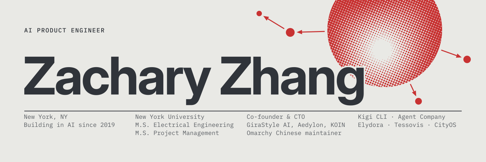

[zacharyzhang.com](https://zacharyzhang.com) · [LinkedIn](https://www.linkedin.com/in/zacharyzhangee/) · [yang@zacharyzhang.com](mailto:yang@zacharyzhang.com)

## About

Hi, I'm Zachary Zhang, an AI product engineer with an electrical engineering background and dual master's degrees from NYU (Electrical Engineering and Project Management). I've been building in AI since 2019, as a co-founder, core investor, and full-time engineer, shipping ten-plus products and independent projects across fintech, pharmaceutical compliance, consumer AI, and industrial edge computing. I work at the intersection of product and engineering, taking end-to-end ownership of the full product lifecycle.

## Projects

### Independent

<table>
<thead><tr><th align="left" width="25%">Project</th><th align="left" width="9999">What it is</th><th align="left" width="16.67%">Stack</th></tr></thead>
<tbody>
<tr><td valign="top"><strong><a href="https://kigicli.dev">Kigi CLI</a></strong> · <a href="https://github.com/ZacharyZhang-NY/Kigi-CLI">repo</a></td><td valign="top">Coding agent that plans a task DAG, runs workers in parallel Git worktrees, and verifies every node.</td><td valign="top"><code>Rust</code></td></tr>
<tr><td valign="top"><strong><a href="https://agent-company.dev">Agent Company</a></strong></td><td valign="top">Runs AI agents as a company: departments, roles, tasks, approvals, and an audit log.</td><td valign="top"><code>Electron</code> <code>SQLite</code></td></tr>
<tr><td valign="top"><strong><a href="https://elydora.com">Elydora Infra</a></strong></td><td valign="top">Tamper-evident audit trail for agent actions: Ed25519 signatures, hash chains, and an open protocol.</td><td valign="top"><code>Protocol</code></td></tr>
<tr><td valign="top"><strong><a href="https://tessovis.com">Tessovis</a></strong></td><td valign="top">Self-hosted ontology runtime that turns enterprise data into objects and actions agents can query, simulate, and execute.</td><td valign="top"><code>Ontology</code></td></tr>
<tr><td valign="top"><strong>CityOS</strong></td><td valign="top">AI city operating system for governance: ontology, multi-agent analysis, simulation, and actions. POC for Kuala Lumpur.</td><td valign="top"><code>Multi-agent</code></td></tr>
<tr><td valign="top"><strong><a href="https://the-greatest.win">Ask the Greatest</a></strong></td><td valign="top">Conversations with historical figures on iOS, Android, HarmonyOS, and web. 500+ users, 50+ paying.</td><td valign="top"><code>Mobile</code> <code>Web</code></td></tr>
<tr><td valign="top"><strong><a href="https://www.medical-regulation.com">MedReg AI</a></strong></td><td valign="top">Regulatory compliance for medical devices, pharmaceuticals, and supplements.</td><td valign="top"><code>RAG</code> <code>Next.js</code></td></tr>
<tr><td valign="top"><strong><a href="https://anti-pua.org">Anti-PUA</a></strong></td><td valign="top">Helps users recognize and resist manipulation tactics.</td><td valign="top"><code>React Native</code></td></tr>
<tr><td valign="top"><strong><a href="https://omarchy.org">Omarchy</a></strong></td><td valign="top">Chinese maintainer. Started OmarchyCN (localization, Fcitx5, mirrors): ~10,000 downloads in two days.</td><td valign="top"><code>Linux</code></td></tr>
</tbody>
</table>

Also: Vigil, Ely-Novel, ELY-Browser.

### Company products

<table>
<thead><tr><th align="left" width="25%">Product</th><th align="left" width="9999">What it is</th><th align="left" width="16.67%">Stack</th></tr></thead>
<tbody>
<tr><td valign="top"><strong><a href="https://koin.ai">KOIN AI</a></strong></td><td valign="top">AI investment platform: ~20,000 US stocks and 20,000+ ETFs, 7×24 multi-agent monitoring, brokerage integration.</td><td valign="top"><code>Swift</code> <code>Kotlin</code> <code>Next.js</code></td></tr>
<tr><td valign="top"><strong><a href="https://girastyleai.com">GiraStyle AI</a></strong></td><td valign="top">AI fashion platform: native SwiftUI iOS app and a React/TypeScript enterprise console.</td><td valign="top"><code>SwiftUI</code> <code>React</code></td></tr>
<tr><td valign="top"><strong><a href="https://aedylon.com">Aedylon</a></strong></td><td valign="top">AI ad production platform; a Rust backend runs the quote-to-delivery workflow.</td><td valign="top"><code>Rust</code></td></tr>
<tr><td valign="top"><strong><a href="https://stablelance.com">Stablelance</a></strong></td><td valign="top">Fiverr-style freelance marketplace settled in stablecoins. Launched, now discontinued.</td><td valign="top"><code>Next.js</code> <code>Web3</code></td></tr>
<tr><td valign="top"><strong>Defect detection (PinOn)</strong></td><td valign="top">Jetson vision system on a 100+ m production line, 20+ inspection points, for a Japanese listed company.</td><td valign="top"><code>NVIDIA Jetson</code> <code>CV</code></td></tr>
</tbody>
</table>

## Experience

<table>
<thead><tr><th align="left" width="25%">Company</th><th align="left" width="25%">Role</th><th align="left" width="16.67%">Period</th><th align="left" width="9999">Scope</th></tr></thead>
<tbody>
<tr><td valign="top"><strong>GiraStyle AI</strong></td><td valign="top">Co-founder &amp; CTO</td><td valign="top">2025 – present</td><td valign="top">Product, architecture, SwiftUI iOS app, enterprise web platform</td></tr>
<tr><td valign="top"><strong>Aedylon</strong></td><td valign="top">Co-founder &amp; CTO</td><td valign="top">2024 – present</td><td valign="top">Ad production platform: front end, Rust backend, workflow</td></tr>
<tr><td valign="top"><strong>American Health Formulations</strong></td><td valign="top">Project Manager</td><td valign="top">2023 – present</td><td valign="top">SOP and training system, SEDDS product line, company websites</td></tr>
<tr><td valign="top"><strong>KOIN</strong></td><td valign="top">Co-founder, CTO, investor</td><td valign="top">2020 – present</td><td valign="top">AI investment platform, KOIN Brain, brokerage and SEC/FINRA work</td></tr>
<tr><td valign="top"><strong>Stablelance</strong></td><td valign="top">CTO / CIO</td><td valign="top">2024 – 2025</td><td valign="top">Stablecoin freelance marketplace, end to end</td></tr>
<tr><td valign="top"><strong>PinOn Inc.</strong></td><td valign="top">Co-founder, CTO, investor</td><td valign="top">2019 – 2022</td><td valign="top">Jetson edge AI, production line defect detection</td></tr>
</tbody>
</table>

## Education

<table>
<thead><tr><th align="left" width="25%">School</th><th align="left" width="9999">Degree</th><th align="left" width="16.67%">Years</th></tr></thead>
<tbody>
<tr><td valign="top">New York University</td><td valign="top">M.S. Project Management</td><td valign="top">2020 – 2022</td></tr>
<tr><td valign="top">New York University</td><td valign="top">M.S. Electrical Engineering</td><td valign="top">2018 – 2020</td></tr>
<tr><td valign="top">Rose-Hulman Institute of Technology</td><td valign="top">B.S. Electrical Engineering</td><td valign="top">2014 – 2018</td></tr>
</tbody>
</table>

## Skills

<table>
<thead><tr><th align="left" width="25%">Area</th><th align="left" width="9999">Tools</th></tr></thead>
<tbody>
<tr><td valign="top">AI agents</td><td valign="top">multi-agent systems, agent runtimes, planning and verification, ontology and simulation, RAG</td></tr>
<tr><td valign="top">Languages</td><td valign="top">Rust, Swift, TypeScript, Python, Kotlin, C, MATLAB, Verilog</td></tr>
<tr><td valign="top">Mobile</td><td valign="top">SwiftUI, native Android, HarmonyOS, React Native</td></tr>
<tr><td valign="top">Web and desktop</td><td valign="top">React, Next.js, TanStack, Node.js, Electron</td></tr>
<tr><td valign="top">Data</td><td valign="top">PostgreSQL, SQLite</td></tr>
<tr><td valign="top">Vision and edge</td><td valign="top">NVIDIA Jetson, computer vision, edge inference, DSP</td></tr>
<tr><td valign="top">Product</td><td valign="top">product definition, UI/UX (Figma), API and data model design, Agile, Six Sigma</td></tr>
</tbody>
</table>

## Contact

[zacharyzhang.com](https://zacharyzhang.com) · [LinkedIn](https://www.linkedin.com/in/zacharyzhangee/) · [yang@zacharyzhang.com](mailto:yang@zacharyzhang.com)
